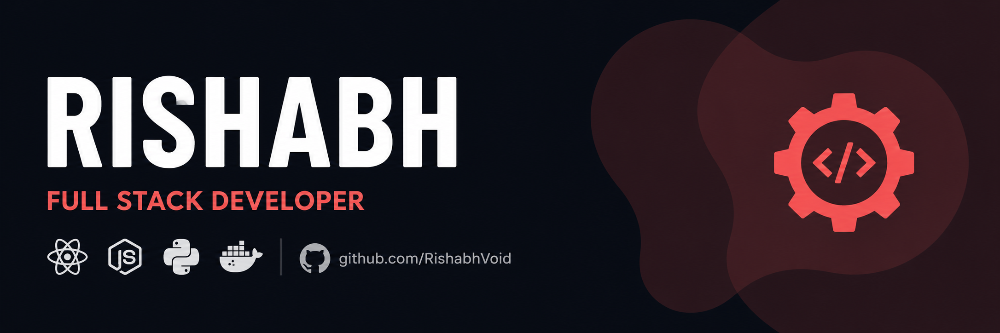

  

 

  

 

---

## 👋 Hi, I'm Rishabh

I'm a self-taught full stack developer based in Delhi. I run **Infron**, my solo dev practice where I take on contract work for international clients building production systems from the ground up. Full lifecycle ownership: APIs, integrations, automation pipelines, DevOps, deployments. Real infrastructure, real users, real deadlines.

Started making game plugins a few years back. Loved building more than playing. Been at it ever since.

- 🔭 Currently building production systems across web and mobile
- 🤖 Integrating AI into real workflows with OpenAI, OpenCV and n8n
- 🌱 Getting deeper into PyTorch, WebRTC and Web3
- 💬 Ask me about full stack dev, DevOps, or AI integrations
- 🤝 Open to collabs, internships and interesting problems

---

## 🛠️ Tech Stack

### 💻 Languages

### 🧠 Frontend

### ⚙️ Backend

### 🗄️ Databases and Storage

### 🔗 ORMs and Query Tools

### ☁️ Cloud and Infrastructure

### 🔄 DevOps and CI/CD

### 🤖 AI and Automation

### 🔧 Tools

### 🚀 Exploring

---

## 💼 Experience

### Infron · Founder · Nov 2025 – Present
My solo dev practice. I take on contract work for international clients building end-to-end production systems. Full ownership from architecture to deployment: APIs, third-party integrations, automation workflows, containerised infra, cloud deployments on AWS, GCP and DigitalOcean. Work is under NDA but happy to walk through it in person.

`Docker` `Nginx` `GitHub Actions` `n8n` `AWS` `GCP` `DigitalOcean` `Redis` `PostgreSQL` `Node.js` `React` `MongoDB`

---

### StyleZen · Full Stack Developer · Jun – Aug 2025
[StyleZen](https://stylezen.app) is an AI-powered outfit recommendation app live on Android and iOS with thousands of users. Worked on backend systems and AI integration pipeline.

`React Native` `Node.js` `Flask` `MongoDB` `Firebase` `OpenAI` `Python`

---

### Naai India · Full Stack Developer · Aug 2024 – Feb 2025
Salon management platform. Built the Partner Dashboard used daily by salon staff for service management, real-time POS tracking, and appointment scheduling.

`Next.js` `Tailwind CSS` `Node.js` `Express` `MongoDB` `Firebase`

---

## 🏆 Achievements

- 🥉 **2nd Runner Up** at Code-A-Haunt National Hackathon, LPU Punjab
- 🥇 **1st Position** at Internal SIH Screening
- 🎓 **Vice President** at University Tech Club and DSA Club
- 🏅 **Top 50** students selected across batch at Geeta University

---

## 📊 GitHub Stats

---

## 🎮 Outside Code

Watching anime (FMAB forever) · Indie games built in pure code · Browsing Dribbble · Weightlifting · Fishing

---

  Started with game plugins. Still building. Always will be.

